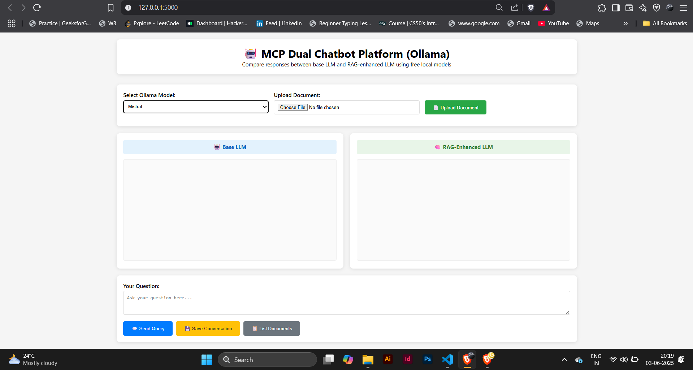

# 🤖 MCP Dual Chatbot Comparison Platform

A modern web-based platform that allows you to compare responses between a base LLM and a RAG-enhanced LLM side-by-side. Built with Flask, MCP (Model Context Protocol), and Ollama for **completely free** local AI models.

  





## ✨ Features

- **📊 Side-by-Side Comparison**: Compare base LLM vs RAG-enhanced responses
- **📄 Document Upload**: Upload text files to provide context for RAG
- **🆓 Free Local Models**: Uses Ollama - no API keys or costs
- **🔄 Model Selection**: Choose from multiple available Ollama models
- **💾 Conversation History**: Save and manage chat sessions
- **🎨 Modern UI**: Clean, responsive web interface
- **⚡ Real-time Updates**: Live chat with loading indicators
- **🔍 Context Transparency**: See what context was used for RAG responses

## 🏗️ Architecture

```
┌─────────────────┐    ┌─────────────────┐    ┌─────────────────┐
│   Web Browser   │◄──►│   Flask App     │◄──►│   MCP Server    │
│  (Frontend UI)  │    │ (API Gateway)   │    │ (Doc Storage)   │
└─────────────────┘    └─────────────────┘    └─────────────────┘
                                │
                                ▼
                       ┌─────────────────┐
                       │ Ollama Service  │
                       │ (Local LLMs)    │
                       └─────────────────┘
```

## 🚀 Quick Start

### Prerequisites

1. **Python 3.8+**
2. **Ollama** - [Install from ollama.ai](https://ollama.ai)

### Installation

```bash
# 1. Clone or create the project directory
mkdir mcp-dual-chatbot
cd mcp-dual-chatbot

# 2. Create project structure
mkdir templates

# 3. Set up Python environment
python3 -m venv venv
source venv/bin/activate  # Windows: venv\Scripts\activate

# 4. Install dependencies
pip install flask==2.3.3 requests==2.31.0 mcp==0.4.0
```

### Setup Ollama Models

```bash
# Start Ollama service (keep this running)
ollama serve

# In another terminal, pull some models
ollama pull llama2        # ~3.8GB - General purpose
ollama pull mistral       # ~4.1GB - Fast and capable  
ollama pull phi           # ~1.6GB - Lightweight
ollama pull orca-mini     # ~1.9GB - Great for chat
```

### Run the Application

```bash
# Make sure Ollama is running in another terminal
ollama serve

# Run the Flask app
python app.py
```

Open your browser and navigate to: **http://localhost:5000**

## 📁 Project Structure

```
mcp-dual-chatbot/
├── server.py              # MCP server for document management
├── app.py                 # Flask web application
├── requirements.txt       # Python dependencies
├── setup.sh              # Setup automation script
├── README.md             # This file
└── templates/
    └── index.html        # Web interface
```

## 🎯 How to Use

### 1. Upload Documents
- Click "Upload Document" to add text files
- These documents provide context for the RAG-enhanced bot
- Supports .txt, .pdf, .doc, .docx files

### 2. Select Model
- Choose from available Ollama models in the dropdown
- The app automatically detects installed models
- Both bots use the same base model

### 3. Ask Questions
- Type your question in the text area
- Hit "Send Query" or press Enter
- Watch both bots respond simultaneously

### 4. Compare Responses
- **Left Panel**: Base LLM response (no additional context)
- **Right Panel**: RAG-enhanced response (with document context)
- Context information is shown below RAG responses

### 5. Save Conversations
- Click "Save Conversation" to store chat history
- View uploaded documents with "List Documents"

## 🔧 Configuration

### Ollama Settings
- **Default URL**: `http://localhost:11434`
- **Timeout**: 30 seconds per request
- **Streaming**: Disabled for consistent responses

### Model Recommendations
| Model | Size | Best For | Speed |
|-------|------|----------|-------|
| `phi` | 1.6GB | Quick responses | ⚡⚡⚡ |
| `orca-mini` | 1.9GB | Conversations | ⚡⚡ |
| `llama2` | 3.8GB | General purpose | ⚡ |
| `mistral` | 4.1GB | Quality responses | ⚡ |
| `codellama` | 3.8GB | Code tasks | ⚡ |

## 🐛 Troubleshooting

### Common Issues

**"Cannot connect to Ollama"**
```bash
# Make sure Ollama is running
ollama serve

# Check if it's accessible
curl http://localhost:11434/api/version
```

**"No models available"**
```bash
# List installed models
ollama list

# Pull a model if none are installed
ollama pull llama2
```

**"Request timed out"**
- Try a smaller model like `phi`
- Reduce query complexity
- Check system resources

**SSL/TLS Errors**
- These are resolved by using local Ollama instead of external APIs
- Ensure you're using the updated code with Ollama integration

### Performance Tips

1. **Start with smaller models** (`phi`, `orca-mini`) for faster responses
2. **Use SSD storage** for better model loading times
3. **Allocate sufficient RAM** (8GB+ recommended for larger models)
4. **Keep queries concise** for faster processing

## 🔌 API Endpoints

| Endpoint | Method | Description |
|----------|--------|-------------|
| `/` | GET | Main web interface |
| `/models` | GET | List available Ollama models |
| `/upload_document` | POST | Upload document for RAG |
| `/chat` | POST | Send query to both bots |
| `/save_conversation` | POST | Save chat history |
| `/list_documents` | GET | List uploaded documents |

## 🛠️ Development

### Adding New Features

1. **MCP Tools**: Add new tools in `server.py`
2. **API Endpoints**: Extend `app.py` with new routes
3. **UI Components**: Modify `templates/index.html`

### Code Structure

- **`server.py`**: MCP server handling document storage and RAG context
- **`app.py`**: Flask application with Ollama integration
- **`index.html`**: Modern web interface with dual chat panels


## 🤝 Contributing

1. Fork the repository
2. Create a feature branch
3. Make your changes
4. Test with different Ollama models
5. Submit a pull request

## 📄 License

This project is licensed under the MIT License - see the [LICENSE](LICENSE) file for details.

## 🙏 Acknowledgments

- **[Ollama](https://ollama.ai)** - For providing free, local LLM access
- **[MCP](https://github.com/modelcontextprotocol/python-sdk)** - Model Context Protocol
- **[Flask](https://flask.palletsprojects.com/)** - Web framework
- **Meta, Mistral AI, Microsoft** - For open-source models


---

**Made with ❤️ for the AI community by Priyanka A (GitHub: https://github.com/PriyankaAnantha/)**

**No API keys required | 100% free and local**